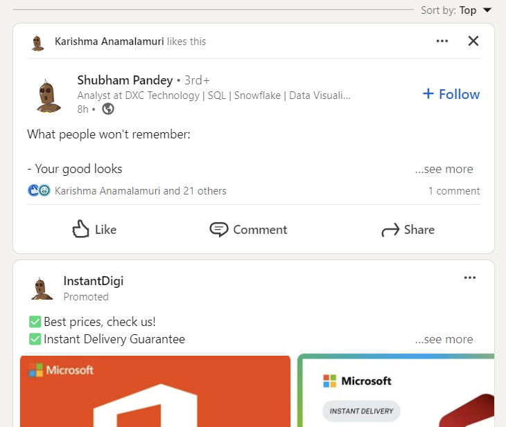

# LinkedIn Profile Picture Changer

## Description

The LinkedIn Profile Picture Changer is a Chrome extension that replaces all profile pictures on LinkedIn with a default image. 

## Features

- Replaces all profile pictures on LinkedIn with a default image.
- Customizable default profile picture URL.
- Works seamlessly in the background without interfering with other LinkedIn functionalities.

## Usage

1. **Installation**:
   - Download the extension files from the repository.
   - Open Google Chrome and go to `chrome://extensions/`.
   - Enable "Developer mode" in the top right corner.
   - Click on "Load unpacked" and select the directory containing the extension files.

2. **Activation**:
   - Once installed, the extension will automatically start running when you visit LinkedIn.

3. **Customizing Default Profile Picture**:
   - The default profile picture used by the extension is `'https://robohash.org/username.png'`.
   - You can customize this URL by modifying the `DEFAULT_PROFILE_PICTURE_FOR_ALL_USER` constant in the `content.js` file.

## Demo
- 
- [Watch the recording proof](assets/recordingproof.mp4)
- 
- 
- 

## Disclaimer

This extension is built as part of internship application process
